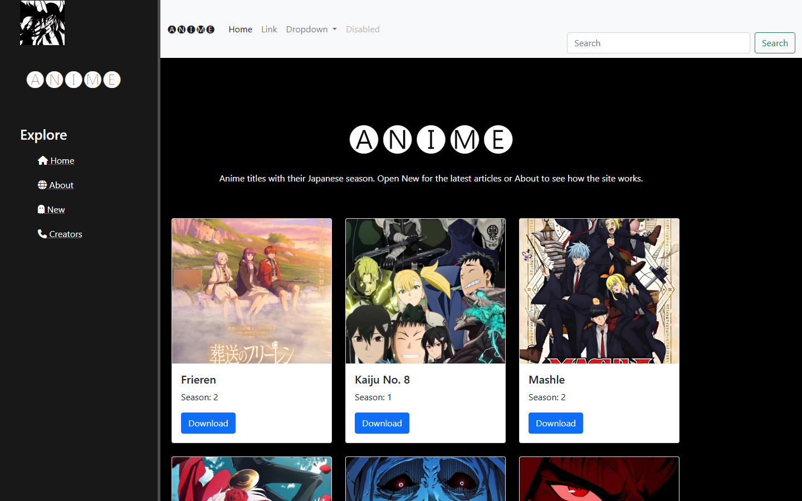

# Anime Moment

Сайт аниме-новостей на Django. Главная показывает тайтлы с сезоном, раздел New хранит статьи, а раздел Creators рассказывает о студиях. Статьи пишут и правят только сотрудники сайта, прямо со страниц, без захода в админку.

[](LICENSE)
[](https://github.com/tgKishikaisei/Djando_saite/actions/workflows/ci.yml)



## Возможности

- Каталог тайтлов с японским сезоном и картинкой по ссылке.
- Лента статей: список, страница статьи, создание, редактирование и удаление для `is_staff`.
- Форма с ошибками возвращается автору целиком, чтобы было видно, что исправить.
- Страница Creators с заметками о студиях, которые админ заполняет в Django admin.

## Стек

Python 3.12, Django 5.2 LTS, SQLite, Bootstrap 5.

## Запуск

```bash
git clone https://github.com/tgKishikaisei/Djando_saite.git
cd Djando_saite
python -m venv venv
venv\Scripts\activate               # Linux и macOS: source venv/bin/activate
pip install -r req.txt
cp .env.example .env                 # впишите DJANGO_SECRET_KEY, для разработки DJANGO_DEBUG=1
python manage.py migrate
python manage.py createsuperuser     # этот пользователь сможет писать статьи
python manage.py runserver
```

Сгенерировать ключ: `python -c "from django.core.management.utils import get_random_secret_key as g; print(g())"`.

## Тесты

```bash
python manage.py test
```

## Живая версия

Публичного стенда нет, проект запускается локально.

## Лицензия

Код: [MIT](LICENSE) © 2023-2026 Behruz Avezmatov. Названия и арт аниме принадлежат их правообладателям.
